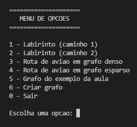
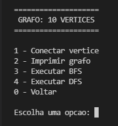
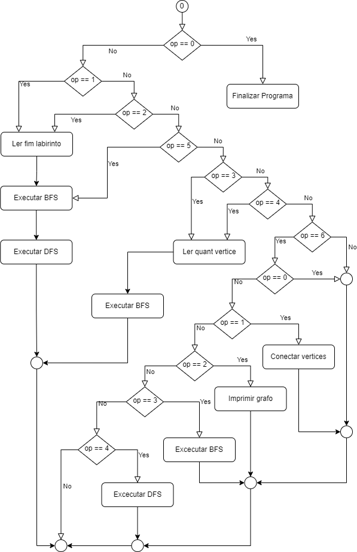

# Trabalho Grafo

## Compilacao

- Para compilar utilizar os comandos abaixo:

> make

> make clean

> make run

- O codigo foi desenvolvido em ambiente linux ubunto

## Menu

- Ao iniciar o programa tera `7` opções:
	- `0` - Finaliza o programa
	- `1` - Utiliza os dados do [labirinto1](src/files/labirinto1.png) para teste
	- `2` - Utiliza os dados do [labirinto2](src/files/labirinto2.png) para teste
	- `3` - Cria um grafo denso com a quantidade de vertices desejada
	- `4` - Cria um grafo esparso com a quantidade de vertices desejada
	- `5` - Cria um grafo com o [exemplo](src/files/graphExample.png) utilizado em sala

- A opção `6` ira mostra um novo menu:

## Diagrama de Fluxo

- No diagrama abaixo é possivel observar o fluxo de execuções do programa, o simbolo de circulo fechado sem informação dentro representa o loop.

	

