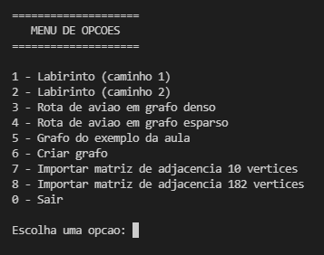
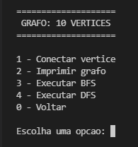
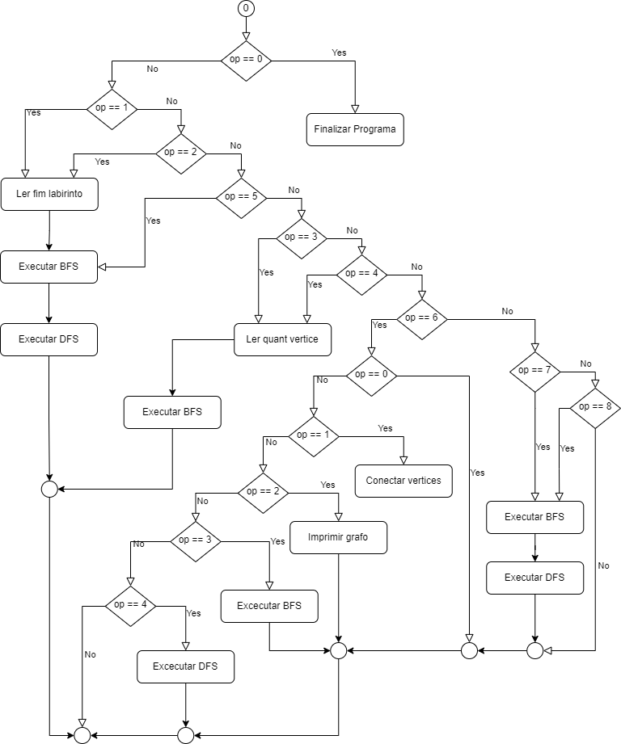

# Trabalho Grafo

## Compilacao

- Para compilar utilizar os comandos abaixo:

> make

> make clean

> make run

- O codigo foi desenvolvido em ambiente linux ubunto

## Menu

- Ao iniciar o programa tera `7` opções:
	- `0` - Finaliza o programa
	- `1` - Utiliza os dados do [labirinto1](src/files/imgs/labirinto1.png) para teste
	- `2` - Utiliza os dados do [labirinto2](src/files/imgs/labirinto2.png) para teste
	- `3` - Cria um grafo denso com a quantidade de vertices desejada
	- `4` - Cria um grafo esparso com a quantidade de vertices desejada
	- `5` - Cria um grafo com o [exemplo](src/files/imgs/graphExample.png) utilizado em sala

- A opção `6` ira mostra um novo menu:

### Mapeamento

- Para representar o caminho em formato de grafo utilizando como base o [labirinto1](src/files/imgs/labirinto1.png), cada quadrado é um vertice, sendo um total de `182` vertices.

- Os quadraos `pretos` são as paredes, logo eles não sao conectados a nenhum outro vertice, os quadrados `brancos` são os caminhos, e todas as suas adjacencias são conectadas, sendo no maixmo `4` adjacencias em um vertice, tendo como resultado o seguinte [grafo](src/files/imgs/grafo.png).

- O grafo gerado para o [labirinto2](src/files/imgs/labirinto2.png) é semelhante ao grafo acima, com a diferença de que um de seus caminhos é modificada de `branco` para `preto`.

### Resultado do labirinto

- Ao selecionar a opcao `1` definindo o fim do labirinto como `181` e executar a `DFS`, sera gerado o [caminho1](src/files/imgs/caminho1.png)

- Ao selecionar a opcao `2` definindo o fim do labirinto como `181` e executar a `DFS`, sera gerado o [caminho2](src/files/imgs/caminho2.png)

- Como o [labirinto2](src/files/imgs/labirinto2.png) possui um caminho fechado, a busca na `DFS` não ira encontrar o vertice `181` partindo do inicio, apenas quando finalizar o caminhamento em todos os vertices que estao conectados, que em seguida, ira caminhar no vertice `181`, porem para este problema sera considerado como caminho nao encontrado.

## Diagrama de Fluxo

- No diagrama abaixo é possivel observar o fluxo de execuções do programa, o simbolo de circulo fechado sem informação dentro representa o loop.

	

